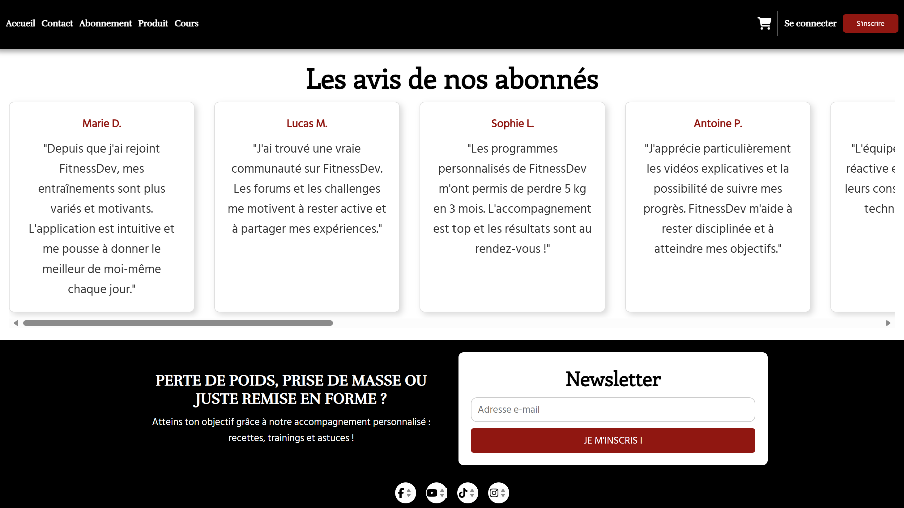
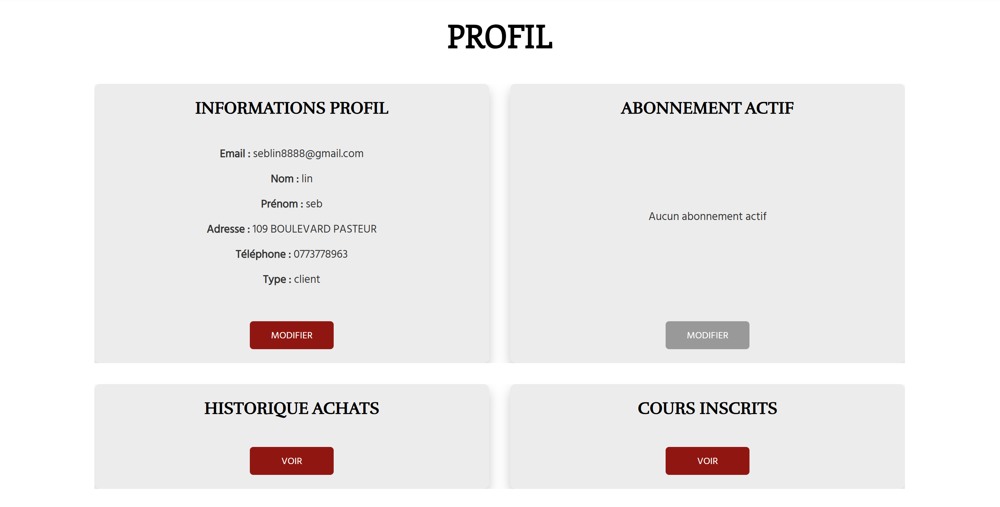

# FitnessDev - Gym Management Application

Welcome to FitnessDev, a comprehensive web application for managing gym registrations, subscriptions, classes, product purchases, and user reviews. This project leverages a modern and robust tech stack, orchestrated with Docker for simplified deployment.


## Table of Contents
- [Features](#features)
- [Technologies Used](#technologies-used)
- [Prerequisites](#prerequisites)
- [Installation](#installation)
  - [Clone the Project](#clone-the-project)
  - [Install Dependencies](#install-dependencies)
  - [Configure `.env` Files](#configure-env-files)
  - [Obtain Firebase Credentials](#obtain-firebase-credentials)
  - [Obtain reCAPTCHA Keys](#obtain-recaptcha-keys)
  - [Generate a JWT Secret](#generate-a-jwt-secret)
  - [Configure the Custom Database](#configure-the-custom-database)
  - [Run the Project Without Docker](#run-the-project-without-docker)
  - [Run with Docker](#run-with-docker)
- [Project Structure](#project-structure)
- [Contributing](#contributing)
- [License](#license)


## Features
- **Home page**


- **Registration and Login**: Users can register with an email, password, and reCAPTCHA validation, then log in to access features.

  
  
- **Subscription Management**: Three plans (ESSENTIAL, ORIGINAL, ULTRA) with customizable options, payment processing, and active subscription verification.

  
  
- **Classes and Coaches**: Display of available classes with specialized coaches (e.g., Boxing, Zumba).

  
  
- **Product Purchases**: Ability to buy products (e.g., protein, drinks) with transaction tracking.

  
  
- **User Reviews**: Logged-in users can add and view reviews stored in Firestore.

  
  
- **User Profile**: User can check his profile and change his informations, subscription, purchases and courses

  
  
- **Contact Pagee**: User can send contact message

  
  

## Prerequisites
- **Node.js** (version 23 or higher): [Download](https://nodejs.org/)
- **Docker** and **Docker Compose**: [Docker Desktop](https://www.docker.com/products/docker-desktop/) or install via your package manager (e.g., `sudo apt install docker.io docker-compose` on Ubuntu).
- **Git**: To clone the repository.
- Access to a Google Cloud/Firestore console and a PostgreSQL server (via Docker or local).


## Installation

### Clone the Project
Clone the Git repository to your local machine:
```bash
git clone https://github.com/hayashiart/fitnessDev.git
cd fitnessDev
```


### Install Dependencies
Install dependencies for the frontend and backend:
- **Frontend**:
  ```bash
  cd my-app-react
  npm install
  ```
- **Backend**:
  ```bash
  cd ../my-backend-express
  npm install
  ```

### Configure `.env` Files
Create a `.env` file in both `my-app-react` and `my-backend-express` directories with the following variables. Copy the content below and customize the values for your environment.

### Obtain Firebase Credentials
- Go to the [Firebase Console](https://console.firebase.google.com/).
- Create a project (e.g., `fitnessdev-65138`) or use an existing one.
- Add a web application:
  - Click the Android/iOS/web icon, then select "Web."
  - Copy the credentials (API Key, Auth Domain, etc.) into the `.env` file:
    ```text
    VITE_FIREBASE_API_KEY=your-api-key
    VITE_FIREBASE_AUTH_DOMAIN=your-auth-domain.firebaseapp.com
    VITE_FIREBASE_PROJECT_ID=your-project-id
    VITE_FIREBASE_STORAGE_BUCKET=your-storage-bucket.appspot.com
    VITE_FIREBASE_MESSAGING_SENDER_ID=your-sender-id
    VITE_FIREBASE_APP_ID=your-app-id
    VITE_FIREBASE_MEASUREMENT_ID=your-measurement-id
    ```

### Obtain reCAPTCHA Keys
- Go to [Google reCAPTCHA Admin](https://www.google.com/recaptcha/admin).
- Sign in with your Google account.
- Create a new key:
  - Select reCAPTCHA v2 > "I'm not a robot" Checkbox.
  - Add `localhost` and `127.0.0.1` as domains.
  - Copy the Site Key and Secret Key into the `.env` file:
    ```text
    VITE_RECAPTCHA_SITE_KEY=your-site-key
    RECAPTCHA_SECRET_KEY=your-secret-key
    ```

### Generate a JWT Secret
- Use a secure generator (e.g., Node.js):
  ```bash
  node -e "console.log(require('crypto').randomBytes(32).toString('base64'))"
  ```
- Copy the output (e.g., `eFBjjsFgv66KhdUewmimxpr7ESZwOf1fqSqnhuY4MPw=`) into the `.env` file:
  ```text
  JWT_SECRET=your-jwt-secret
  ```

### Configure the Custom Database
- The PostgreSQL database requires unique credentials for each user. These values depend on your local or Docker server setup. Configure them as follows:
  - **DB_USER**: PostgreSQL username (default: `postgres`, or use a custom username, e.g., `your-postgres-username`).
  - **DB_PASSWORD**: PostgreSQL user password (choose a unique, secure password, e.g., `yourSecurePassword123`).
  - **DB_HOST**: Host address where PostgreSQL is running (default: `localhost` for local, `172.19.80.1` for external Docker, or `db` for Docker Compose internal service).
  - **DB_NAME**: Database name (default: `FitnessDev_db`, or customize, e.g., `your-database-name`).
  - **DB_PORT**: PostgreSQL port (default: `5432`, or `5433` if mapped in Docker—check your configuration).
  - Example:
    ```text
    DB_USER=your-postgres-username
    DB_HOST=localhost
    DB_NAME=your-database-name
    DB_PASSWORD=your-secure-password
    DB_PORT=5432
    POSTGRES_USER=your-postgres-username
    POSTGRES_PASSWORD=your-secure-password
    POSTGRES_DB=your-database-name
    ```

### Run the Project Without Docker
- **Frontend**:
  ```bash
  cd my-app-react
  npm run dev
  ```
- **Backend**:
  ```bash
  cd my-backend-express
  npm start
  ```
- Ensure PostgreSQL is running locally and configured with the `.env` credentials.
- Access the application at `https://localhost:5173/`

### Run with Docker
- From the project root, use Docker Compose to start all services:
  ```bash
  docker-compose up --build
  ```
- Access the application at `http://localhost:3000` (or the port specified in `docker-compose.yml`).


## Contributing
Contributions are welcome! Please follow these steps:
1. Fork the repository.
2. Create a new branch (`git checkout -b feature/your-feature`).
3. Commit your changes (`git commit -m "Add your feature"`).
4. Push to the branch (`git push origin feature/your-feature`).
5. Open a Pull Request.

## License
This project is licensed under the MIT License. See the [LICENSE](LICENSE) file for details.